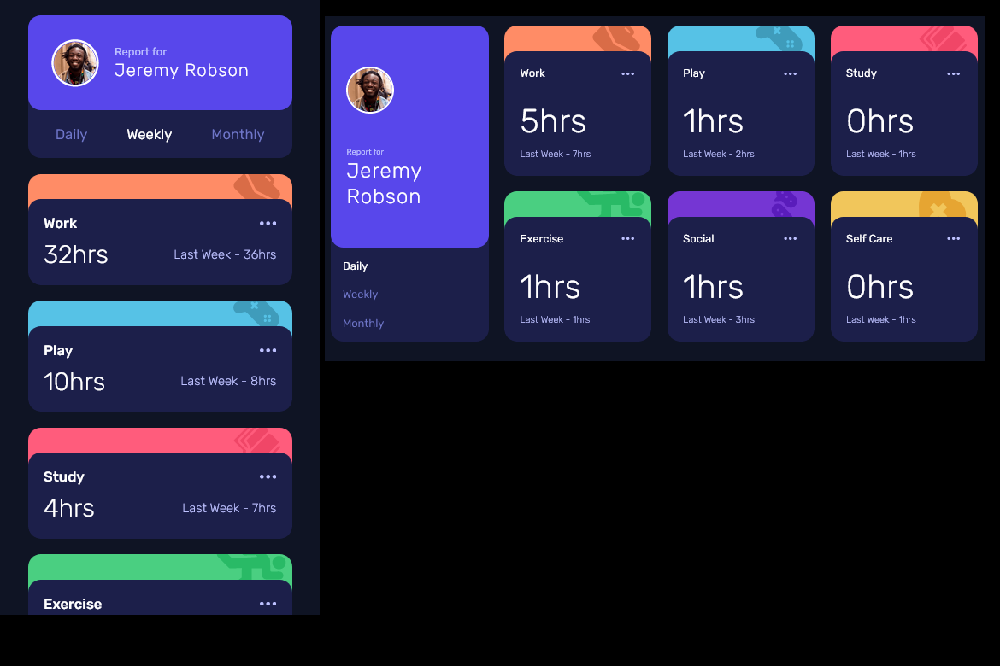

# Frontend Mentor - Time tracking dashboard solution

This is a solution to the [Time tracking dashboard challenge on Frontend Mentor](https://www.frontendmentor.io/challenges/time-tracking-dashboard-UIQ7167Jw). Frontend Mentor challenges help you improve your coding skills by building realistic projects.

## Table of contents

- [Overview](#overview)
  - [The challenge](#the-challenge)
  - [Screenshot](#screenshot)
  - [Links](#links)
- [My process](#my-process)
  - [Built with](#built-with)
  - [What I learned](#what-i-learned)
  - [Continued development](#continued-development)
- [Author](#author)

## Overview

### The challenge

Users should be able to:

- View the optimal layout for the site depending on their device's screen size
- See hover states for all interactive elements on the page
- Switch between viewing Daily, Weekly, and Monthly stats

### Screenshot

### Links

- Solution URL: [My Solution on GitHub](https://github.com/mike-uffelman/FE-Challenge---Time-Tracker-React)
- Live Site URL: [My Solution hosted on Netlify](https://sparkling-bombolone-7f63c8.netlify.app/)

## My process

### Built with

- Semantic HTML5 markup
- CSS custom properties
- Flexbox
- CSS Grid
- Mobile-first workflow
- [React](https://reactjs.org/) - JS library

### What I learned

The intention for this project was to practice building an app using functional React components. The only React hook used in this app was 'useState', which was used to define a piece of state for the user selected timeframe.

The 'timeframe' piece of state was defined on the App.js component so that it could easily be passed down as a prop to the Profile.js and Card.js components. From within those sub components the 'timeframe' state could be updated (resulting in a rerender) or used to reference properties in the data response.

### Continued development

A few concepts which I look forward to using are the other React hooks which seemed to be unnecessary for this application, particularly of those being useEffect and useRef.

## Author

- LinkedIn - [Mike Uffelman](https://www.linkedin.com/in/michael-uffelman-34289521)
- Frontend Mentor - [mike-uffelman](https://www.frontendmentor.io/profile/mike-uffelman)
- GitHub - [mike-uffelman](https://github.com/mike-uffelman)
